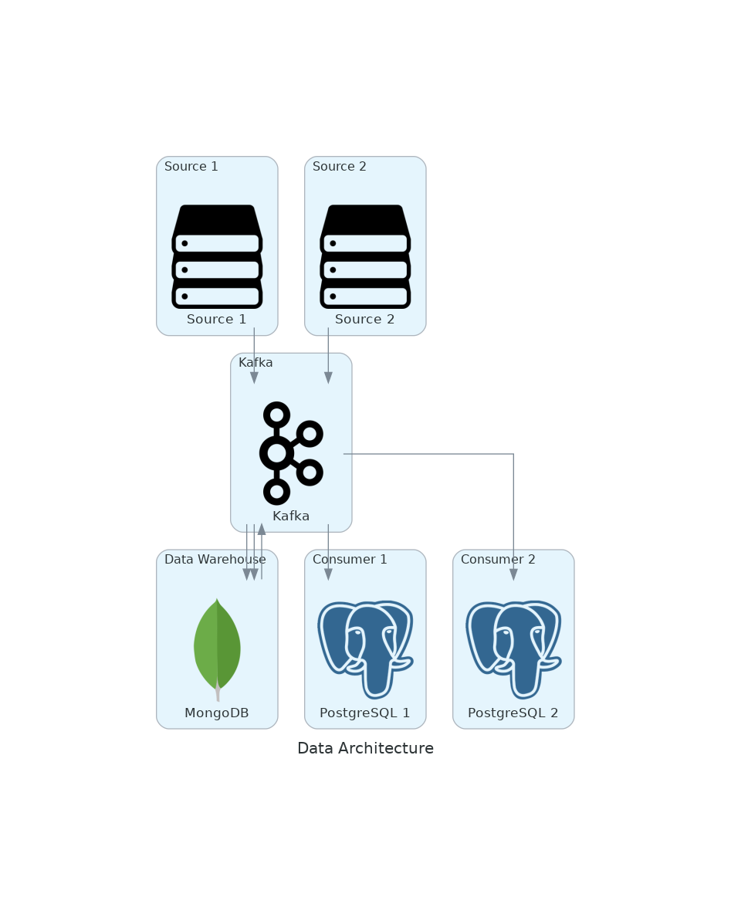
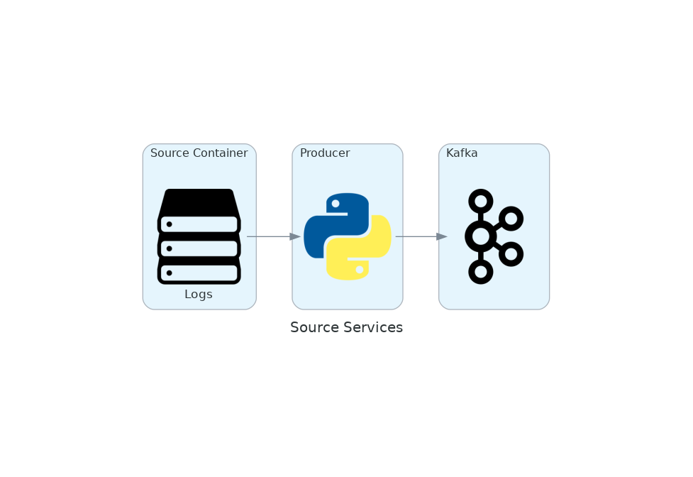
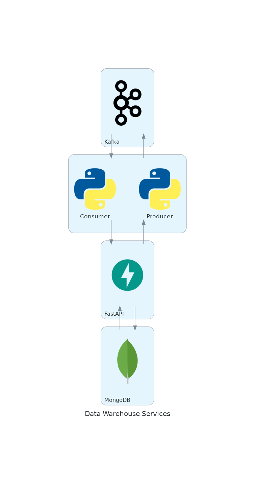
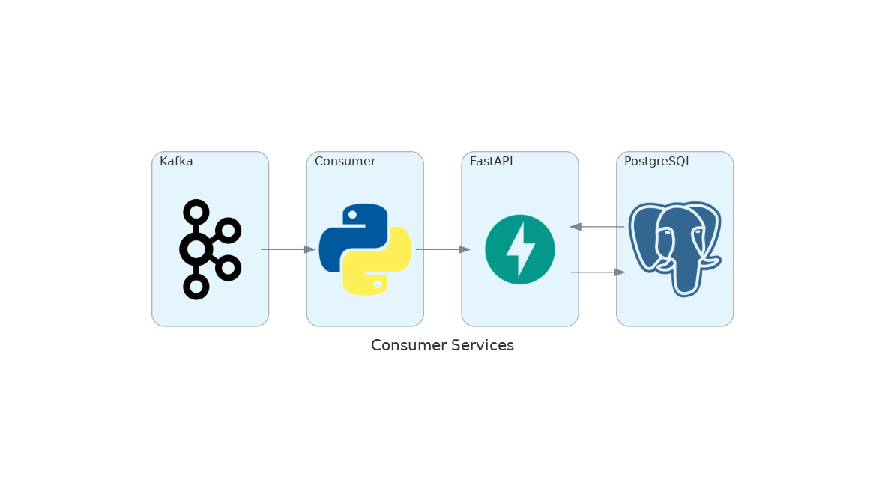
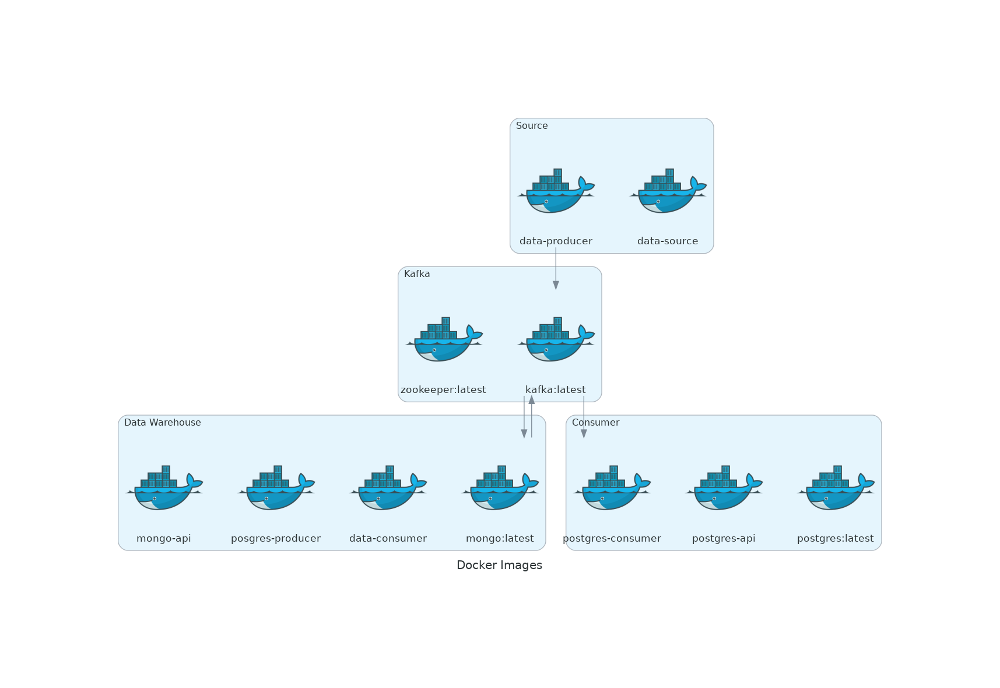

# streaming-project

Kafka
mongodb and postgresql for data storage
FastAPI endpoints to interact with storage

## Data Architecture


## Source Services


## Data Warehouse Services


## Consumer Services


## Docker Images



## Repositories

* [Core services: Kafka, Data Warehouse](https://github.com/josecegra/core-services-streaming)
* [Data Source service](https://github.com/josecegra/data-source-streaming)
* [Data Consumer service](https://github.com/josecegra/data-warehouse-streaming)


## Creating the diagrams

```shell
docker compose up -d --build
```
